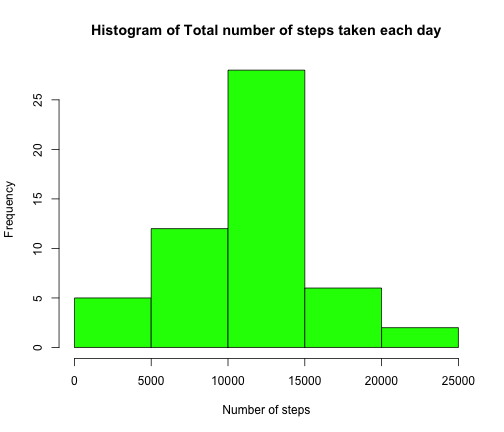
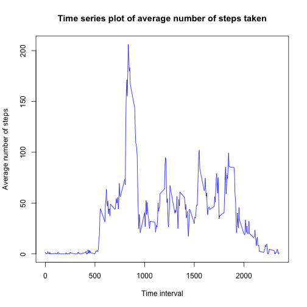
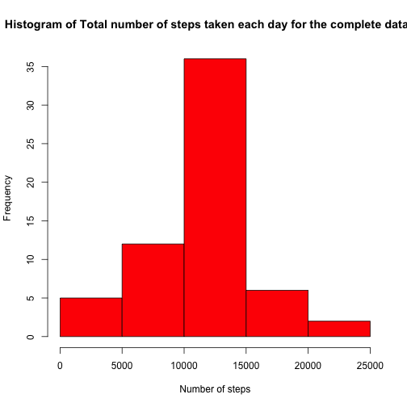
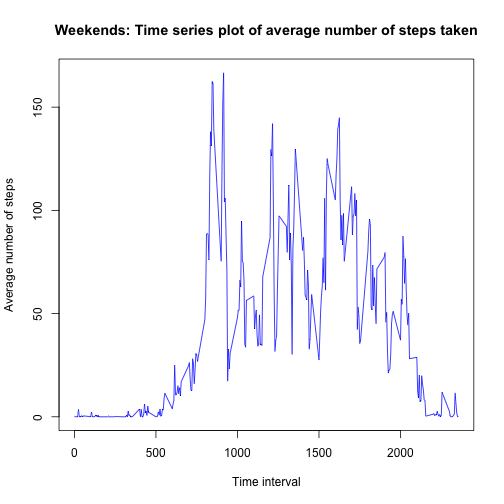
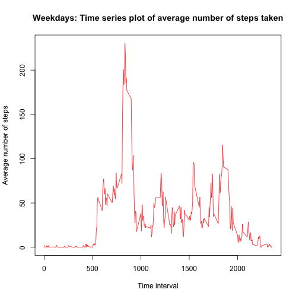

# Reproducible Research: Peer Assessment 1

This is the first peer assessment project of the Reproducible Research course. We use the wearable computing data to analyze the number of steps walked everyday. 

First, we set the working directory, and load the required library packages.


```r
setwd("/Users/kalaivanirameakubendran/datasciencecoursera/RepData_PeerAssessment1")
library(plyr)
```

## Loading and preprocessing the data

The following R code is used to load and preprocess the data. First, the csv file is extracted, and the date column is changed to 'date' class from 'factor' class. 


```r
activity <- read.csv("activity.csv")
activity[,2] <- as.character(activity[,2])
activity[,2] <- as.Date(activity[,2])
```

It is observed from the data that the missing data appears only in the number of steps taken. So, 'complete.cases' command is used to remove the missing values from the dataset for the initial analysis.


```r
complete_activity <- complete.cases(activity)
clean_activity <- activity[complete_activity,]
```

## What is mean total number of steps taken per day?

For this exercise, total number of steps are calculated per day, and then the histogram and the mean and median values are determined. This is done using the 'ddply' command from the "plyr" package.


```r
sum_activity <- ddply(clean_activity, ~date, summarise, sum=sum(steps))
```

The histogram of the total number of steps taken per day are shown as follows.


```r
hist(sum_activity$sum, col="green", xlab="Number of steps", main="Histogram of Total number of steps taken each day")
```

 

The mean value of total number of steps taken per day is


```
## [1] 10766
```

The median value of total number of steps taken per day is


```
## [1] 10765
```

## What is the average daily activity pattern?

Average daily pattern of steps taken is calculated for each day based on the time interval values. This is done using the 'ddply' command from the "plyr" package.


```r
avg_activity <- ddply(clean_activity, ~interval, summarise, mean=mean(steps))
```

The timeseries of the daily pattern is given by,


```r
with(avg_activity, plot(interval, mean, type="l", col="blue", main="Time series plot of average number of steps taken", xlab="Time interval", ylab="Average number of steps"))
```

 

To see at which 5-minute interval the maximum number of steps occur, the following R command is used to find the row at which it occurs.


```r
max_row <- which(avg_activity == max(avg_activity[,2]), arr.ind=TRUE)
avg_activity[max_row[1],]
```

```
##     interval  mean
## 104      835 206.2
```

According to this, the average maximum value of steps occur at the **835th** 5-minute time interval.

## Inputing missing values

The total number of rows that have missing values can be calculated by subtracting the number of rows of the 'cleaned-up dataset' from the total number of rows of the actual dataset.

So, the total number of rows that have missing values is given by,


```
## [1] 2304
```

In this exercise, the missing values are replaced with the average values of respective time intervals that were calculated in the previous exercise.


```r
comp_activity <- activity
for(i in 1:nrow(comp_activity)){
  if(is.na(comp_activity[i,1])){
    tempstep <- comp_activity[i,3]
    for(j in 1:nrow(avg_activity)){
      if(avg_activity[j,1]==tempstep){
        tempmean <- avg_activity[j,2]
        comp_activity[i,1] <- tempmean
      }
    }    
  }
}
```

The total number of steps for each day are calculated in the same way we did for the dataset without missing values.


```r
sum_comp_activity <- ddply(comp_activity, ~date, summarise, sum=sum(steps))
```

The histogram of the dataset with updated values for missing elements is shown as follows.

 

The mean value of the total number of steps taken each day is given by,

```
## [1] 10766
```

The median value of the total number of steps taken each day is given by,


```
## [1] 10766
```

It is observed that the mean values are the same in both the datasets, the ones without missing values, and the ones with substituted missing values. The median values differ a little in these two datasets. In the substituted missing value dataset, the median value is the same as the mean value.

Also, the total number of steps without the missing values is given by:


```
## [1] 570608
```

And, the total number of steps with substituted date for missing values is given by:


```
## [1] 656738
```

So, a difference of **86129.51** steps are included in the new dataset, that has mean and median values close to the cleaned up dataset.

## Are there differences in activity patterns between weekdays and weekends?

A new variable is created in the above dataset that shows the day of the week from the 'date' variable.


```r
comp_activity$wk <- weekdays(comp_activity[,2])
```

Another factor variable is created that categorizes the weekdays and weekends based on the day of the week.


```r
comp_activity$wkfac <- " "
for (m in 1:nrow(comp_activity)){
  if(comp_activity[m,4]=="Saturday" || comp_activity[m,4]=="Sunday"){
    comp_activity[m,5] <- "weekend"
    }
    else {
      comp_activity[m,5] <- "weekday"
    }
}
```

Two sub datasets are created from the main dataset. One for weekdays, and another for weekends.


The time series of the average number of steps taken each day for weekdays and weekends are shown below.


```r
avg_wknd_activity <- ddply(wknd_activity, ~interval, summarise, mean=mean(steps))
with(avg_wknd_activity, plot(interval, mean, type="l", col="blue", main="Weekends: Time series plot of average number of steps taken", xlab="Time interval", ylab="Average number of steps"))
```

 


```r
avg_wkday_activity <- ddply(wkday_activity, ~interval, summarise, mean=mean(steps))
with(avg_wkday_activity, plot(interval, mean, type="l", col="red", main="Weekdays: Time series plot of average number of steps taken", xlab="Time interval", ylab="Average number of steps"))
```

 

It is observed that there is more activity on weekends than weekdays.


